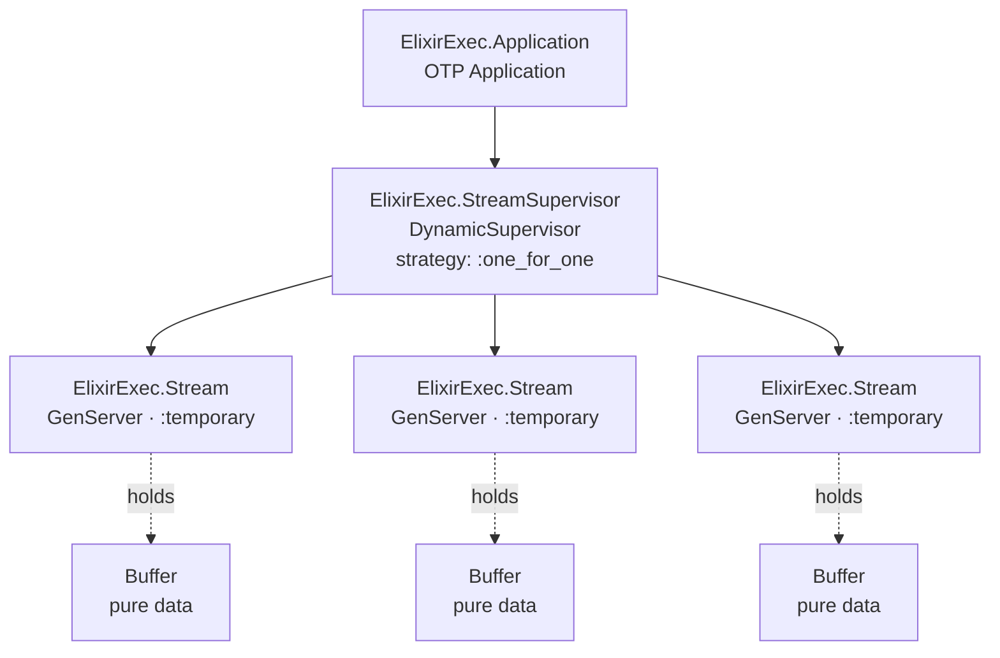
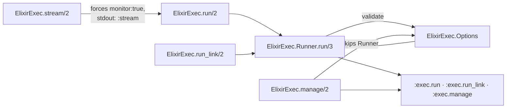
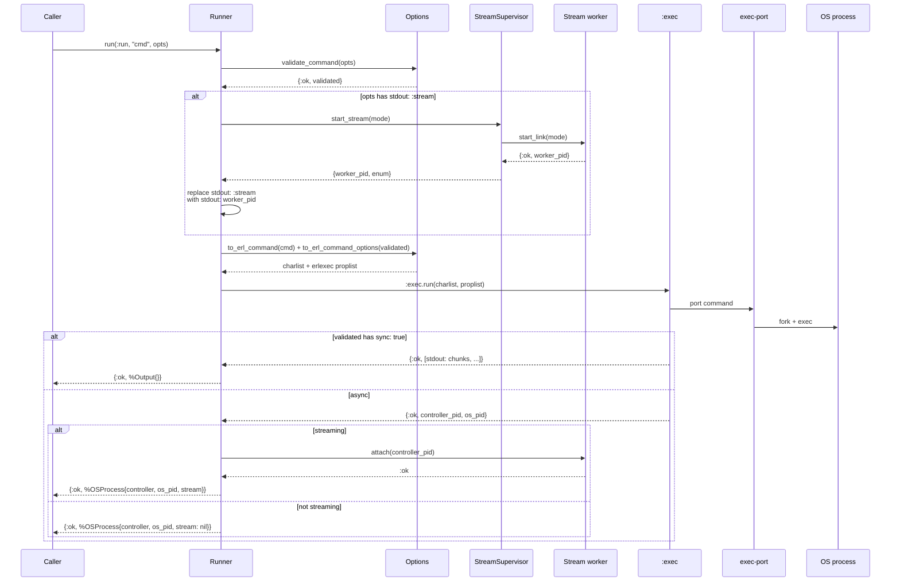
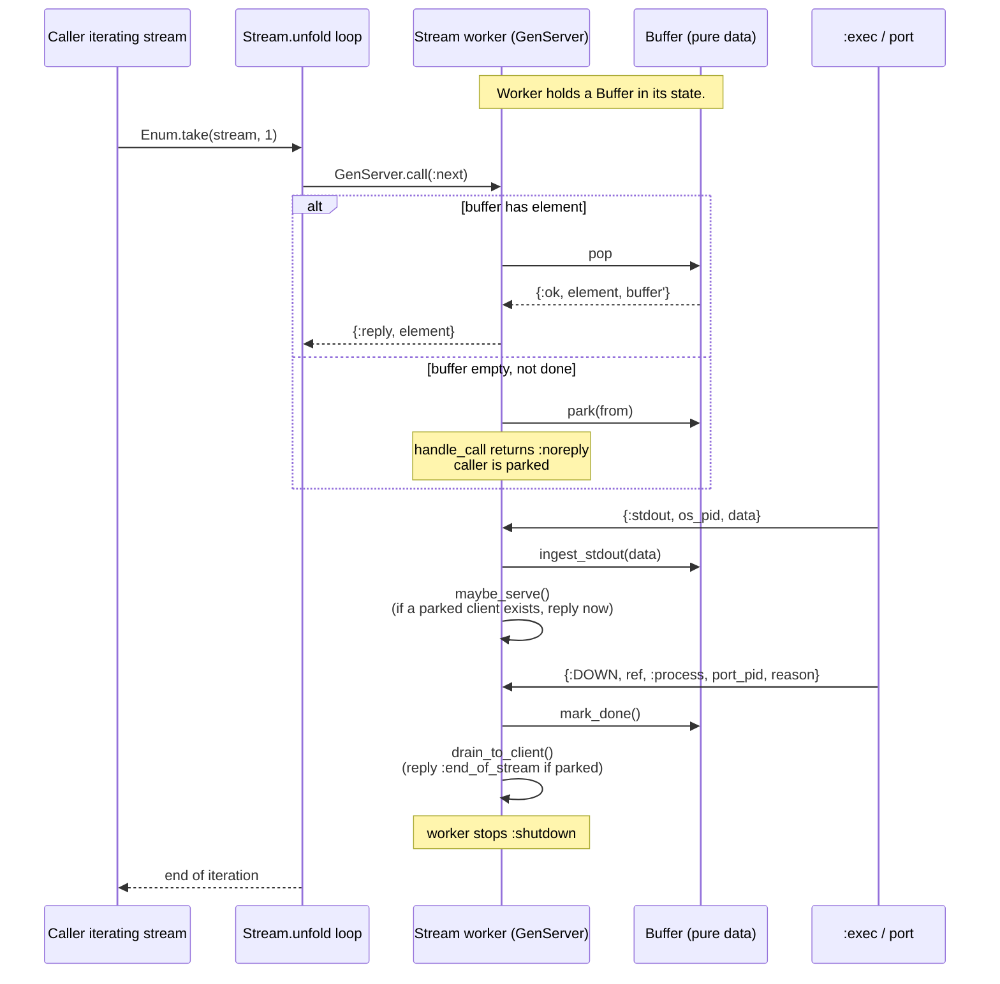

# System Architecture

## Big picture

`elixir_exec` is a wrapper, not an engine. The engine is `:erlexec`, which runs as a single Erlang process plus a port driver to a small C program (`exec-port`) that does the actual `fork/exec`, signal delivery, and IO multiplexing. This library adds three things on top:

1. **Option validation and translation** (`ElixirExec.Options`).
2. **Result wrapping** (`ElixirExec.OSProcess`, `ElixirExec.Output`).
3. **A streaming abstraction** for line-by-line stdout consumption (`ElixirExec.Stream` + `ElixirExec.StreamSupervisor` + `ElixirExec.Stream.Buffer`).

Everything else (process lifetime, signals, stdin) is delegated through to `:erlexec` directly.

## Supervision tree



Stream workers are started **on demand** by `ElixirExec.Runner` only when the caller passes `stdout: :stream` (which `stream/2` does implicitly). Restart strategy is **`:temporary`** — when a worker exits for any reason it stays exited; consumers see iteration end cleanly via the `Stream.unfold/2` accumulator.

`:erlexec` itself is started by its own application and is **not** under this library's supervisor. It runs alongside as a sibling.

```mermaid
graph LR
    Caller[Caller process]
    EE[ElixirExec.* modules<br/>pure functions / GenServer]
    Erlexec[:exec GenServer<br/>from :erlexec app]
    Port[exec-port C binary<br/>fork / exec / signal IO]
    Child[OS child process]

    Caller -->|run/2, stream/2, ...| EE
    EE -->|:exec.run / :exec.manage| Erlexec
    Erlexec -->|port commands| Port
    Port -->|fork+exec| Child
    Port -.stdout/stderr/exit.-> Erlexec
    Erlexec -.{:stdout, os_pid, data}<br/>{:stderr, ...}<br/>{:DOWN, ...}.-> Caller
    Erlexec -.same messages.-> EE
```

## Public entry points



`run/2`, `run_link/2`, and `stream/2` go through `ElixirExec.Runner.run/3`. `manage/2` calls `:exec.manage` directly — there is no streaming or sync mode for adopted processes.

## Runner pipeline

`ElixirExec.Runner.run/3` is the single funnel for every fresh process start. It is a small pipeline:



Two-stage validation in `ElixirExec.Options.validate_command/1`:

1. NimbleOptions schema check.
2. Cross-key illegal-combination check (currently: `sync: true` with `stdout: :stream` is rejected as `{:error, {:illegal_combination, :sync_with_stream}}`).

Both stages run **before** any process is forked, so a misconfigured call never leaves a zombie behind.

## Streaming model

When `stream/2` (or any `run/2` with `stdout: :stream`) is invoked:



Modes accepted by `ElixirExec.Stream.start_link/1` and `Buffer.new/1`:

| Mode | What gets buffered | Element shape |
|---|---|---|
| `:lines` (default for `stream/2`) | stdout, split on `"\n"` with the newline kept; trailing partial flushed at exit. | `binary()` — one line per element. |
| `:chunks` | stdout, raw chunks as they arrive from `:erlexec`. | `binary()` — one chunk per element. |
| `:stderr` | stderr, raw chunks. | `binary()`. |
| `:merged` | both streams, tagged. | `{:stdout, binary()} \| {:stderr, binary()}`. |

The buffer is a plain `:queue` plus a small amount of mode-specific state (a partial line accumulator for `:lines`, a `done?` flag, an optional parked-client `from`). Backpressure is consumer-driven: if no caller is iterating, the buffer just grows; if the caller is faster than the program, the consumer parks until data arrives.

### Race-free attach

The flow has one subtle correctness requirement: the worker must install its `Process.monitor/1` on the `:erlexec` controller pid **before** the controller could possibly exit. `ElixirExec.Stream.attach/2` is a synchronous `GenServer.call` that installs the monitor and returns. `ElixirExec.Runner.run/3` calls `attach/2` immediately after `:exec.run/2` returns and before handing the `%OSProcess{stream: enum}` back to the caller. This closes the race where a very short-lived program could exit before the monitor is set up.

## Error and exit handling

| Source | Surface |
|---|---|
| Option-validation failure | `{:error, %NimbleOptions.ValidationError{}}` from `Runner.run/3`; no process is started. |
| Illegal combination (`sync` + `stream`) | `{:error, {:illegal_combination, :sync_with_stream}}`. |
| `:erlexec` rejects the command | `{:error, term()}` propagated; if a stream worker was started speculatively, `Runner.finalize/2` shuts it down. |
| OS process exits normally | Async runs deliver `{:DOWN, os_pid, :process, ctl_pid, :normal}`; `decode_reason/1` translates this to `0`. |
| OS process exits with status | `{:DOWN, ..., {:exit_status, n}}` → `decode_reason/1` returns `n`. |
| OS process killed by signal | `{:DOWN, ..., {:exit_status, raw}}` where `raw` encodes the signal; `ElixirExec.status/1` decodes to `{:signal, name, dumped?}`. |
| Stream worker exits during iteration | `Stream.unfold` accumulator catches `:noproc`, `:normal`, `:shutdown` from the GenServer and ends iteration cleanly. |

## Concurrency model

- **One stream worker per streaming run.** Workers are independent; nothing crosses between them.
- **No registry, no ETS.** Workers are reachable only via the pid returned in `%OSProcess{}`; the `Enumerable` closes over that pid.
- **Single parked consumer per worker.** The `Buffer` parks at most one `from` reference. Multiple concurrent iterators on the same stream are not a supported pattern.
- **`:exec`'s own registry** is what `os_pid/1`, `pid/1`, and `which_children/0` reach into. This library does not maintain a parallel index.

## Files of interest

| Concern | File |
|---|---|
| Public API surface | `lib/elixir_exec.ex` |
| Application bootstrap | `lib/elixir_exec/application.ex` |
| Validation + Erlang translation | `lib/elixir_exec/options.ex` |
| Runner pipeline | `lib/elixir_exec/runner.ex` |
| Stream worker (GenServer) | `lib/elixir_exec/stream.ex` |
| Stream supervisor | `lib/elixir_exec/stream_supervisor.ex` |
| Stream buffer (pure data) | `lib/elixir_exec/stream/buffer.ex` |
| Result structs | `lib/elixir_exec/output.ex`, `lib/elixir_exec/os_process.ex` |

## See also

- [`api-reference.md`](api-reference.md) — every callable function with its signature and return shape.
- [`configuration-guide.md`](configuration-guide.md) — every option the validator accepts.
- [`testing-guide.md`](testing-guide.md) — how the supervision tree and streaming flow are tested.
